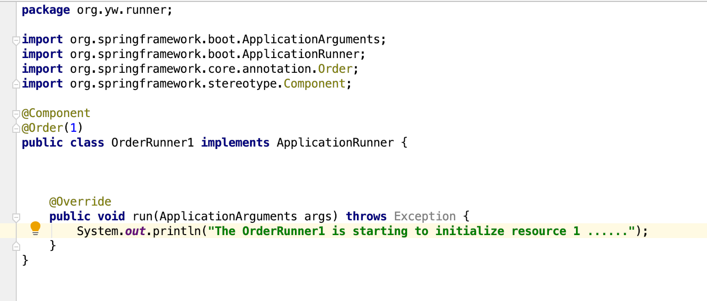
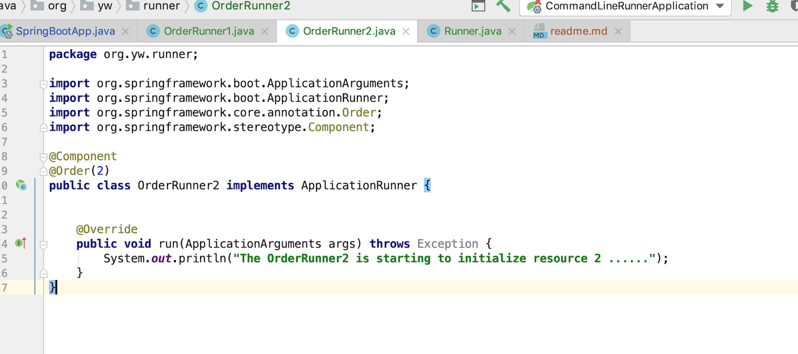
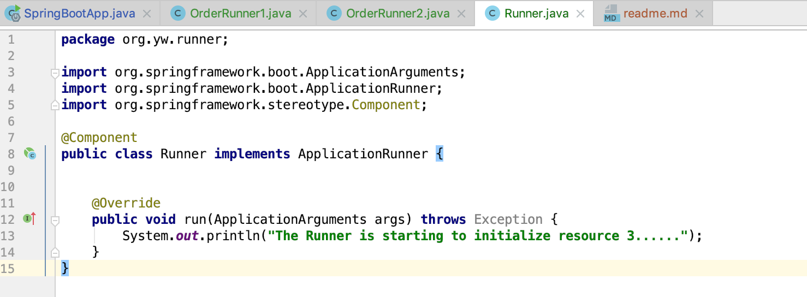
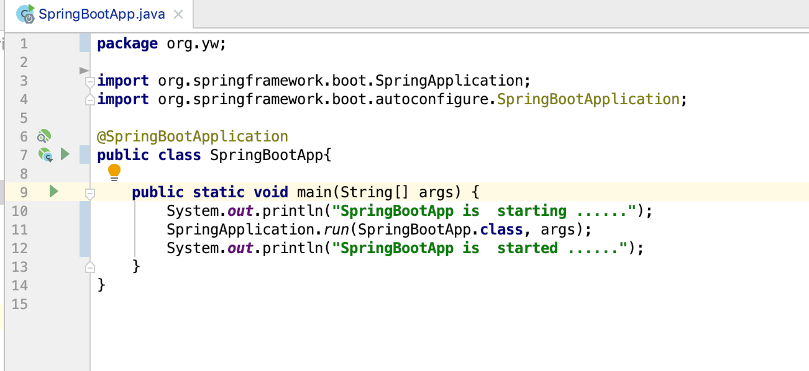

# How to initialize SpringBoot Application's resources in defined orders

Your springboot application will be started from class with @SpringBootApplication , but if your project contains serveal different resources and you need to initialize them in defined orders. How to do this?

You could use ApplicationRunner or CommandLineRunner to do this.  I will use below example to show you how to do initialize 3 resources in defined orders

- To initialize the first resource in OrderRunner1

 

- To initialize the second resource in OrderRunner2

- To initialize the third resource in Runner

- Start the SpringBoot Application, you could see 3 resources are initialized in the expected order.

 