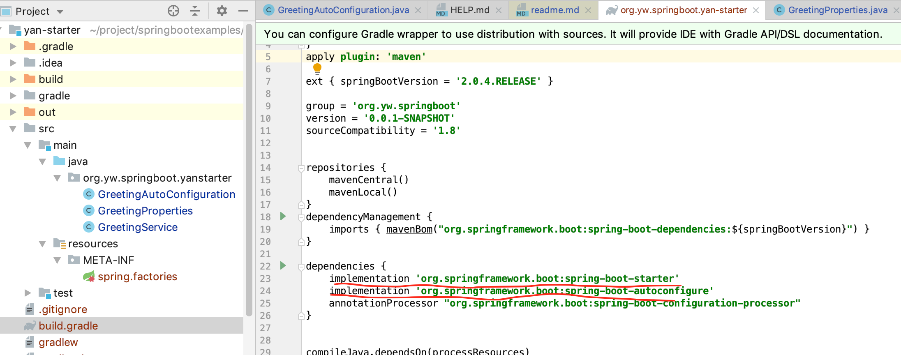
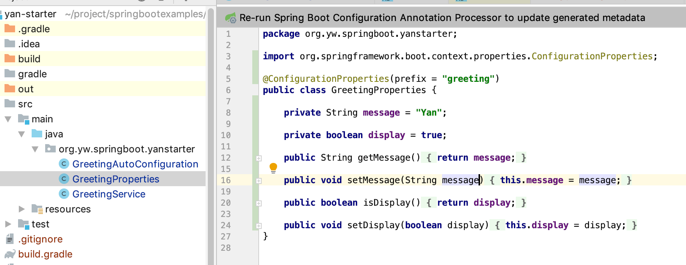
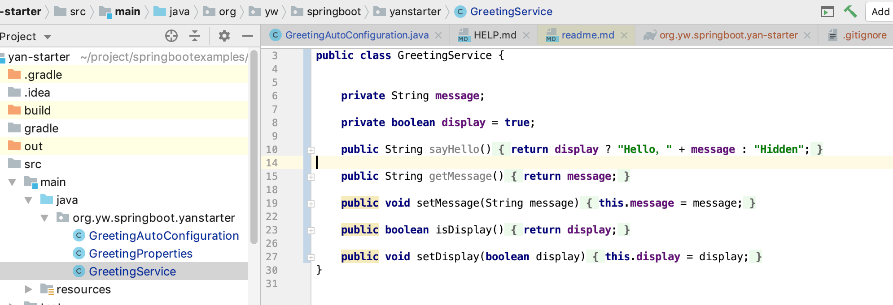
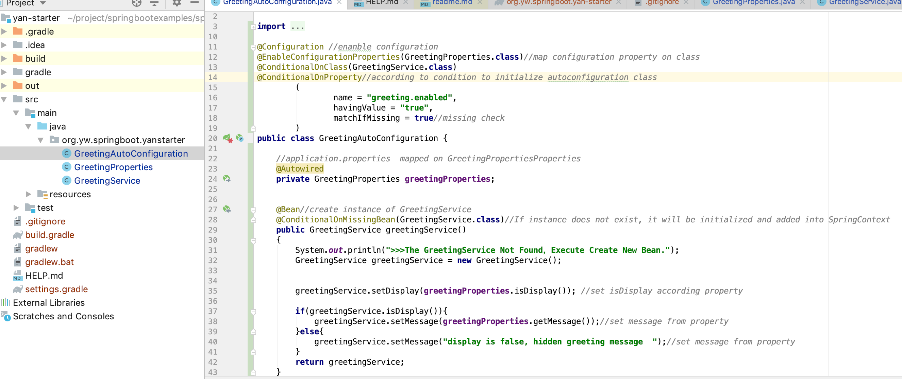
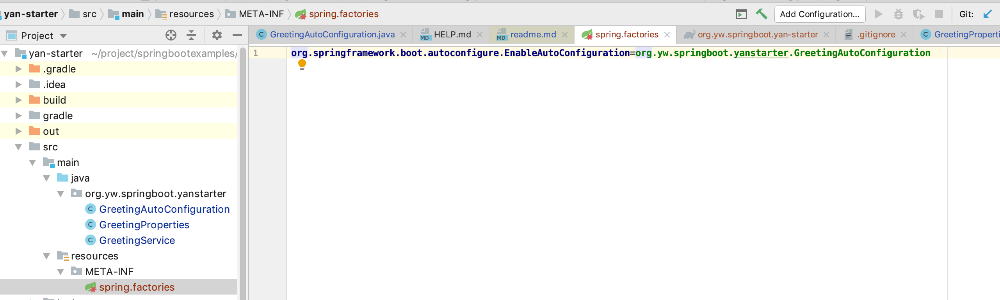
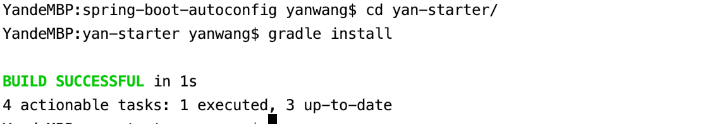
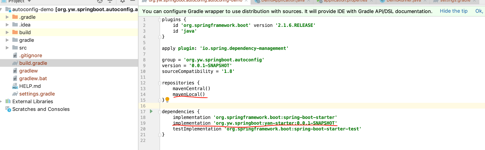
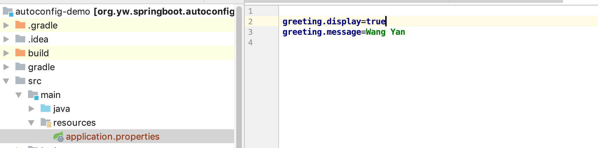
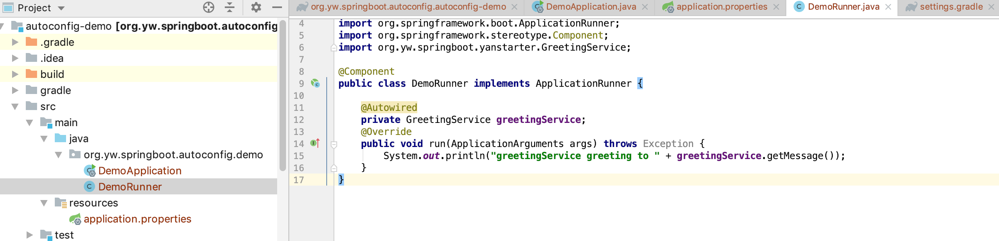
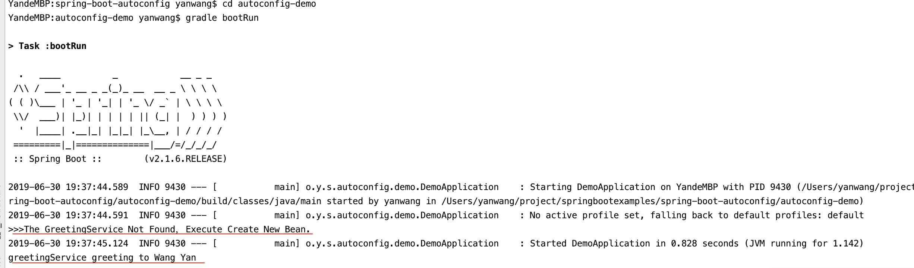

### Implement your own Spring Boot starter for auto configuration 

Spring Boot starter is a core component. For example, if you use spring-boot-starter-web, then a lot of 
configurations for web application will be done automatically for you. 

When you use starter component, you don't need to do much about configuration, you could just add properties in the application.properties file, then starter component can handle them correctly.

Here we use a demo to show you how to implement your own Spring Boot starter to do auto configuration.

You basically just need do 5 things

- Create a your Spring Boot starter template

- Write Java Config
     ```
     @Configuration
     ```
- Add condition
    ```
    @Conditional
    ```
- Locating Auto-configuration Candidates
    ```
    META-INF/spring.factories
    ````
- Integrate your Spring Boot starter into another application.


#### Create a your Spring Boot starter project
- add dependency 'org.springframework.boot:spring-boot-starter'
- add dependency 'org.springframework.boot:spring-boot-autoconfigure'
  
  
#### Write Java Config
- write Properties class
  

- write Service class
  
  
- write AutoConfiguration class
  

####  Locating Auto-configuration Candidates
- add META-INF/spring.factories
  

#### Integrate your Spring Boot starter into the Spring Boot application.
- install your spring starter project into maven local repository as below shown
  
  
- add your Spring Boot starter into the Spring Boot application
  
  
- add properties of auto configured Service class into the Spring Boot application's application.properties
  
  
- use auto configured Service class in the Spring Boot application as below shown
  
  
- run the Spring Boot application, it works
  

  


