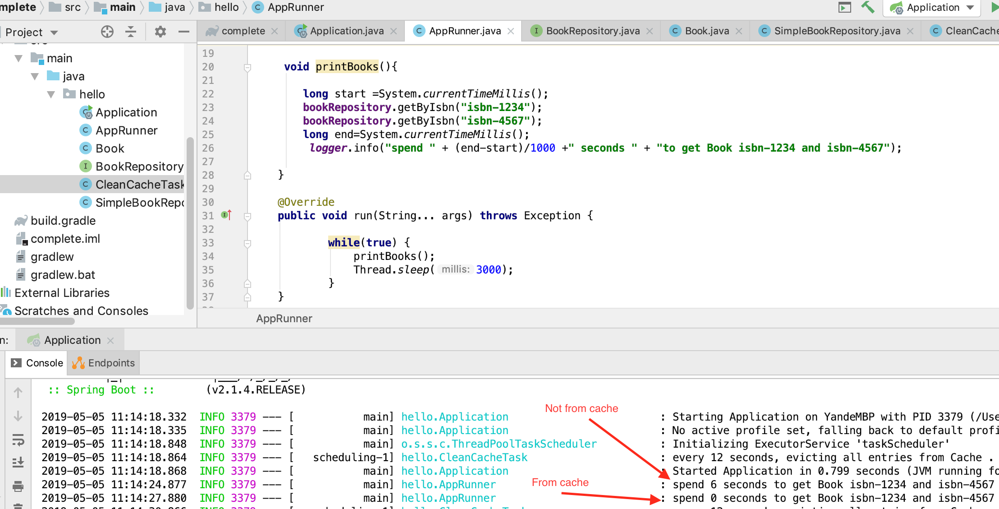
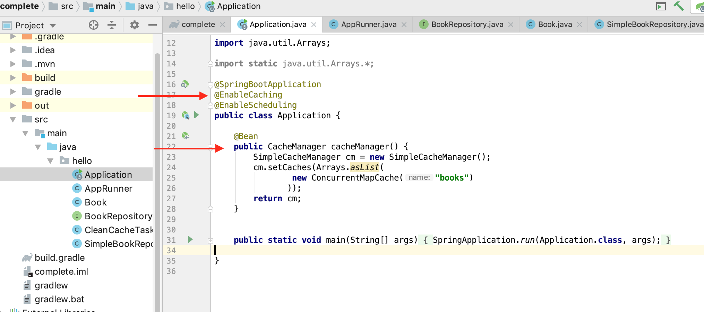
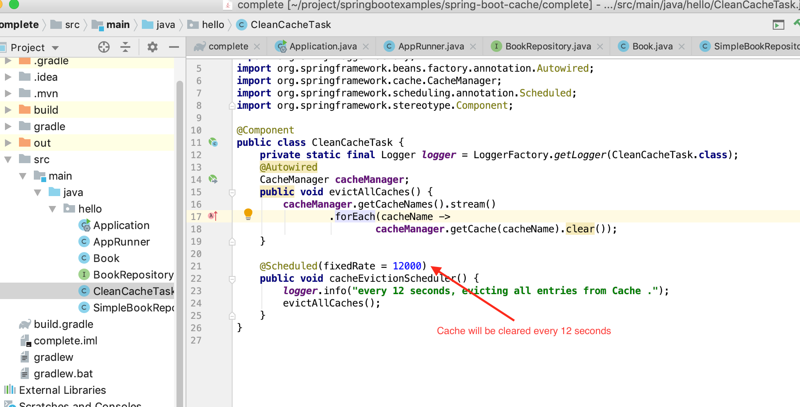
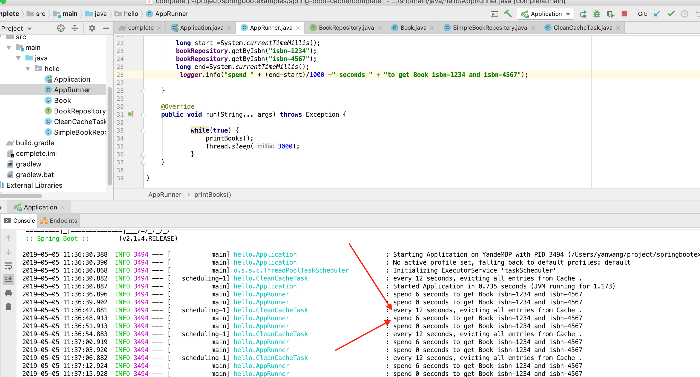

# SpringBoot Cache

This guide walks you through the process of enabling caching and the process of removing caching on a Spring managed bean.

## What you’ll build

You’ll build an application that enables caching  on a simple book repository, and you can also remove caching by SpringBoot's scheuduled  task .

- enable Caching on SpringBoot Application

  

- put results into cache on Dao Implementation 

  

- start your SpringBoot Application, if you try to get results twice, firstly they are not retrieved from cache, second time they will be retrieved from cache as expected.

  

  

- enable scheudle on SpringBoot Application, and inject the CacheManager.

  

- define Scheudled Task to clear cache regularly. 

- start  your SpringBoot Application, after cache is cleared, results will not be retrieved from cache.  

- Reference 

  https://spring.io/guides/gs/caching/