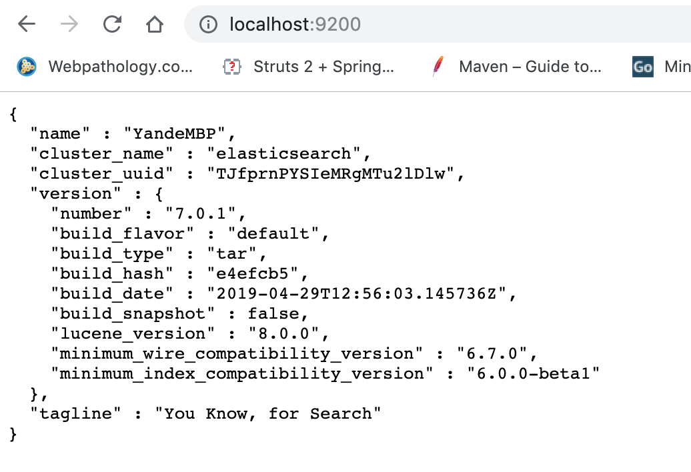

## Getting Started

This Example shows you how to use
ElasticsearchTemplate ,  ElasticsearchRepository , (both of them using TransportClient) to implement ad CRUD SpringBoot Application

## Install elasticsearch 6.4.3 

* Download elasticsearch  6.4.3 (for spring2.1.4)
https://www.elastic.co/cn/downloads/elasticsearch

- install it and run it, after it starts successfully, you could browse it like blow

###  ElasticsearchRepository CRUD 
- Create a SpringBoot Rest Application
Configure setting for ElasticsearchRepository 
 

- Add User as Data model 

- Add UserRepository as Data Depository

- Add UserControler which autowires UserRepository to
implement CRUD functionality 

- Test ElasticsearchRepository CRUD 

  Add user

  List user

  Delete user

### Additional Links
These additional references should also help you:

- Elastic Search 
https://cloud.tencent.com/developer/article/1066239 

https://github.com/RajeshBhojwani/spring-boot-elasticsearch

https://dzone.com/articles/elasticsearch-with-spring-boot-application

https://dzone.com/articles/spring-boot-elasticsearch
https://github.com/RajeshBhojwani/spring-boot-standalone-elasticsearch/blob/master/src/main/java/com/example/elasticsearch/controller/UserController.java

https://piotrminkowski.wordpress.com/2019/03/29/elasticsearch-with-spring-boot/

http://localhost:8080/rest/handys/create

http://localhost:8080/rest/handys/view/001
Content-Type 
application/json

{
  "id":"001",
  "brand": "XiaoMi",
   "details": {
   "model" : "m8",
   "price" : "300 USD",
   "color" : "black"
   }
}