## Getting Started

This Example shows you how to use
ElasticsearchRepository , TransportClient to implement a SpringBoot + Elasticsearch CRUD Application

## Install elasticsearch 6.4.3 

- Download elasticsearch  6.4.3 (for spring2.1.4)
https://www.elastic.co/cn/downloads/elasticsearch

- Install it and run it, after it starts successfully, you could browse it like blow

###  Implement ElasticsearchRepository CRUD 
- Create a SpringBoot Rest Application and set config for ElasticsearchRepository 
 
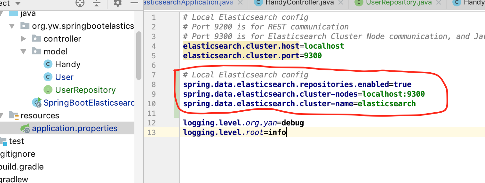

- Create User as data model 
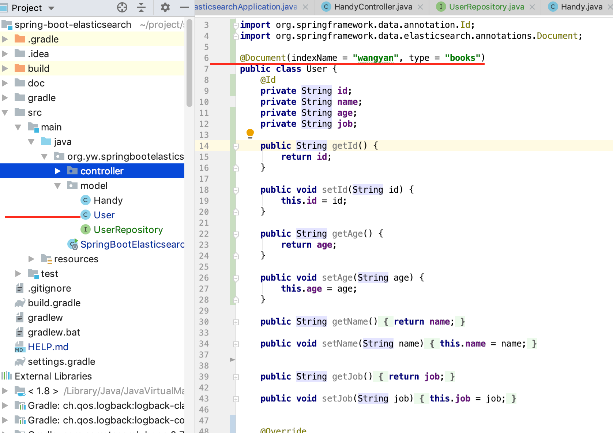

- Create UserRepository
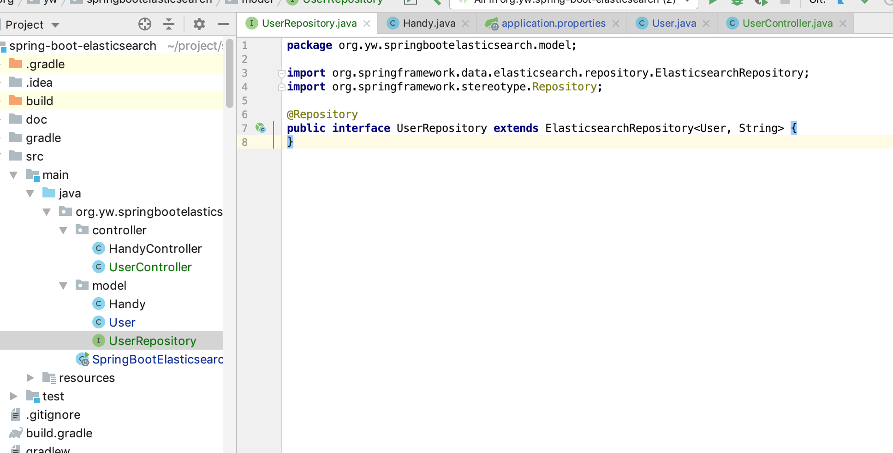

- Create UserController which autowiring UserRepository to implement CRUD functionality 
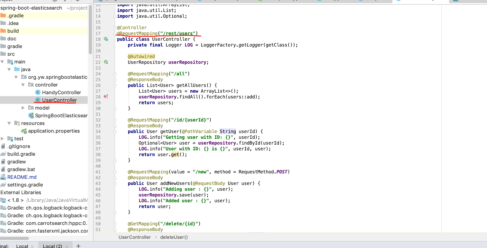
- Test ElasticsearchRepository CRUD functionality via REST (Postman)

    - Add user operation
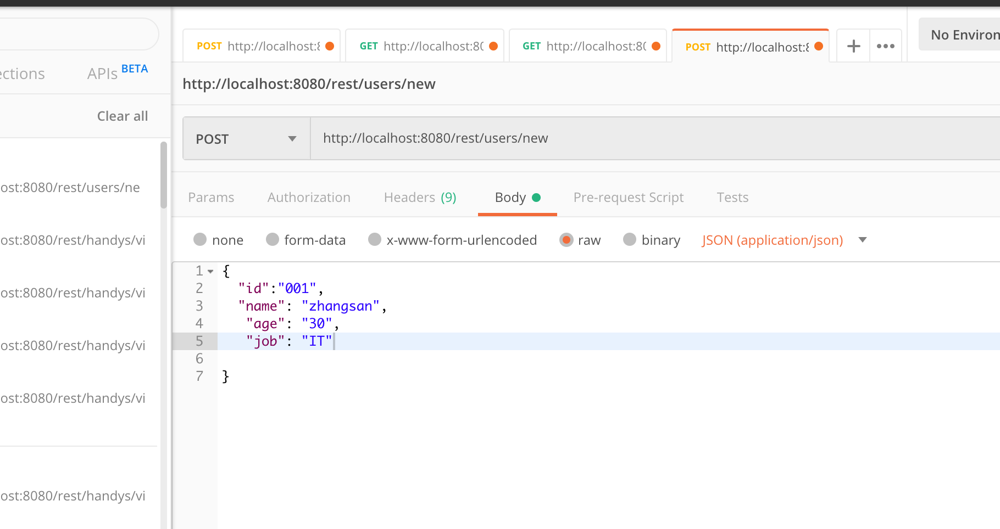

    - List user operation
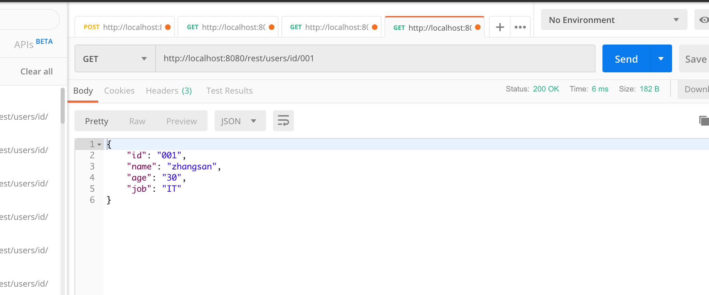

    - Delete user operation

### Implement Elasticsearch TransportClient CRUD 

- Set config for TransportClient

- Create Handy as data model 
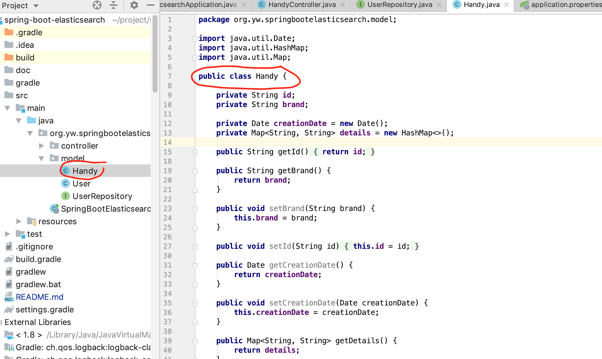

- Create HandyController which autowiring Client to implement CRUD functionality 
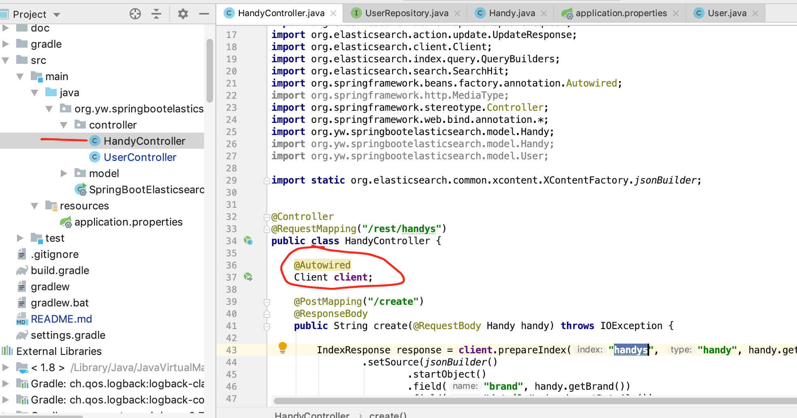

- Test Elasticsearch TransportClient CRUD functionality via REST (Postman)
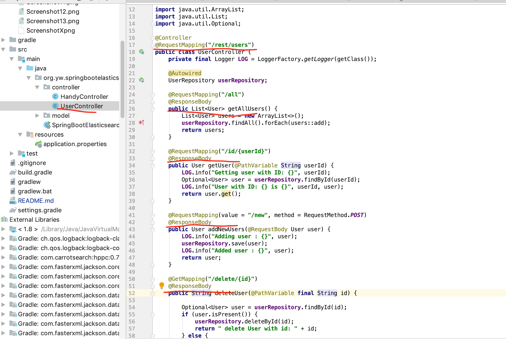

    - Add Handy operation
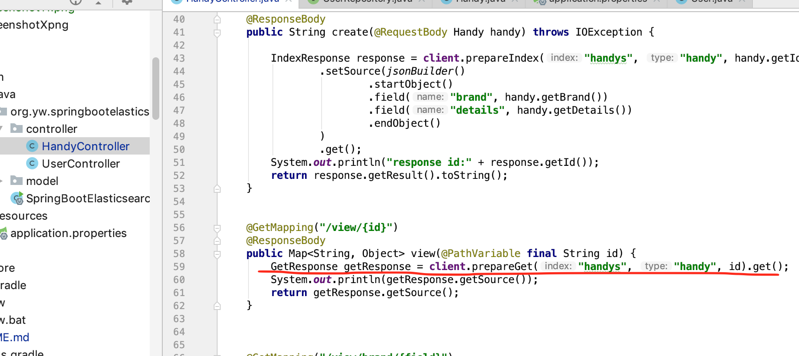

    - View Handy operation
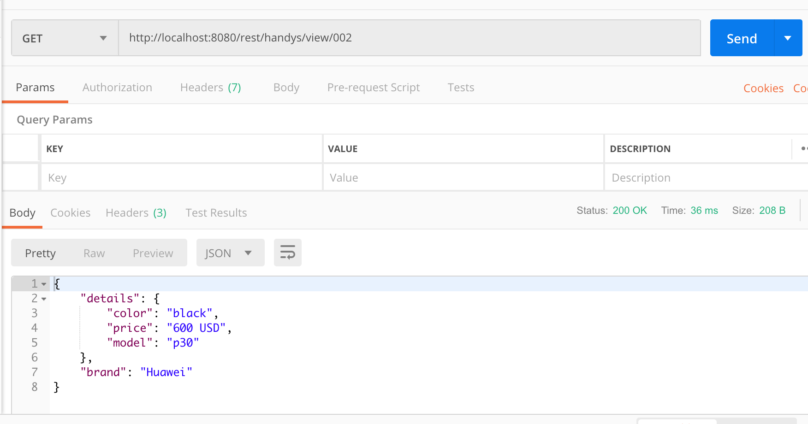

    - Delete Handy operation
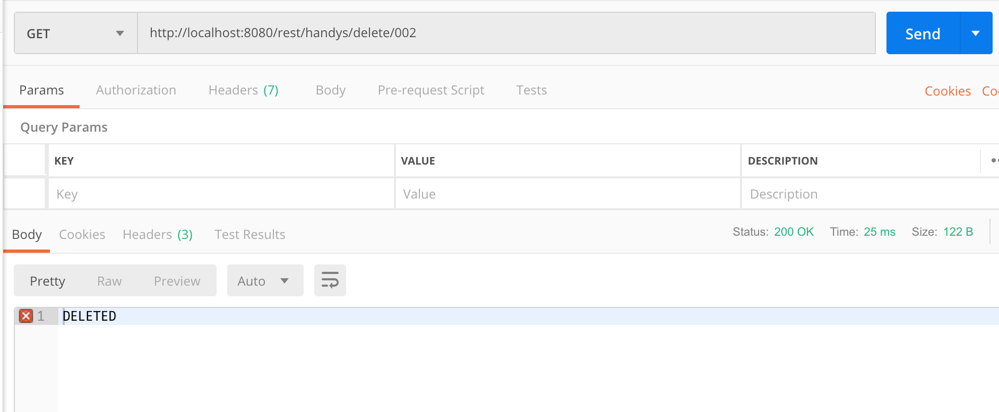

### Additional Links for reference

- https://cloud.tencent.com/developer/article/1066239 

- https://github.com/RajeshBhojwani/spring-boot-elasticsearch

- https://dzone.com/articles/elasticsearch-with-spring-boot-application

- https://dzone.com/articles/spring-boot-elasticsearch

- https://github.com/RajeshBhojwani/spring-boot-standalone-elasticsearch/blob/master/src/main/java/com/example/elasticsearch/controller/UserController.java

- https://piotrminkowski.wordpress.com/2019/03/29/elasticsearch-with-spring-boot/
