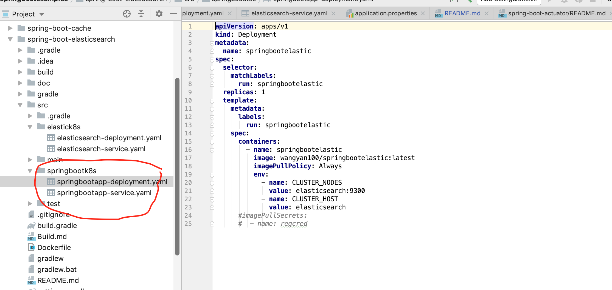
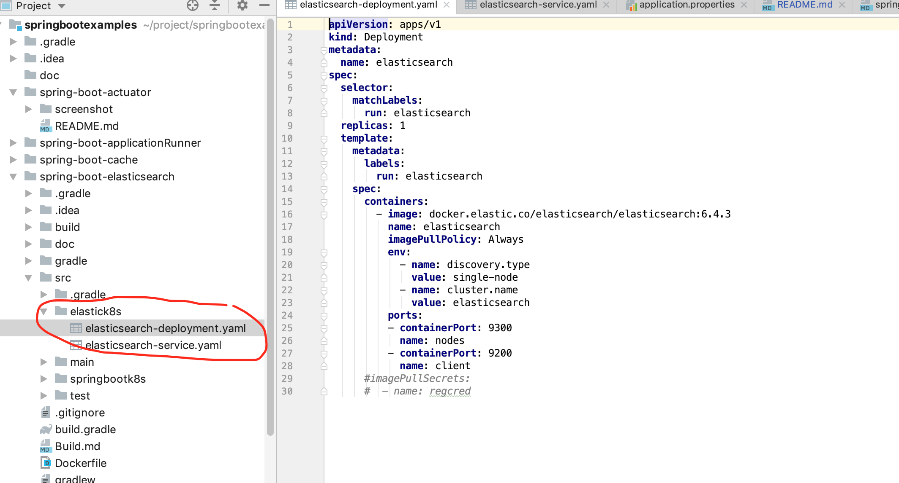
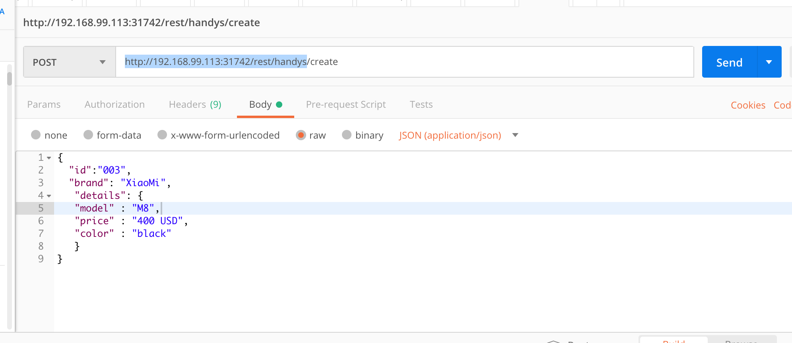
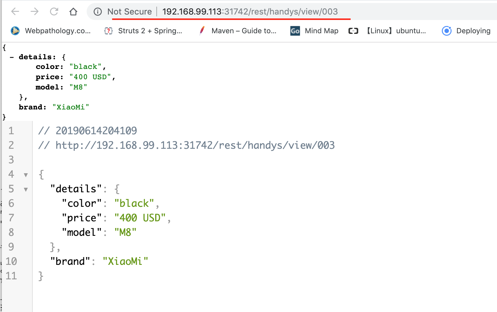
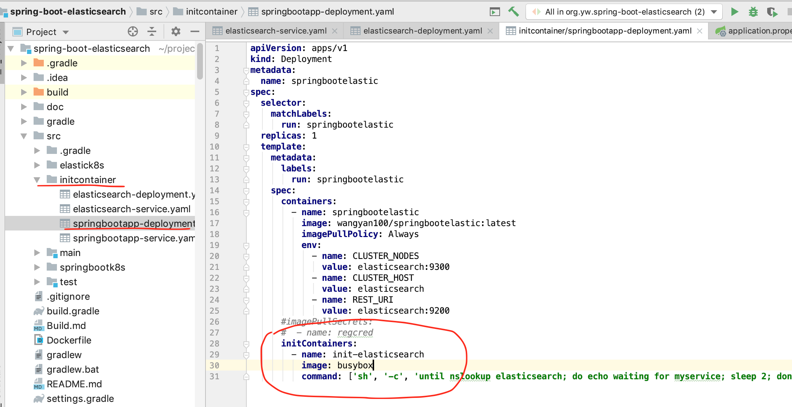
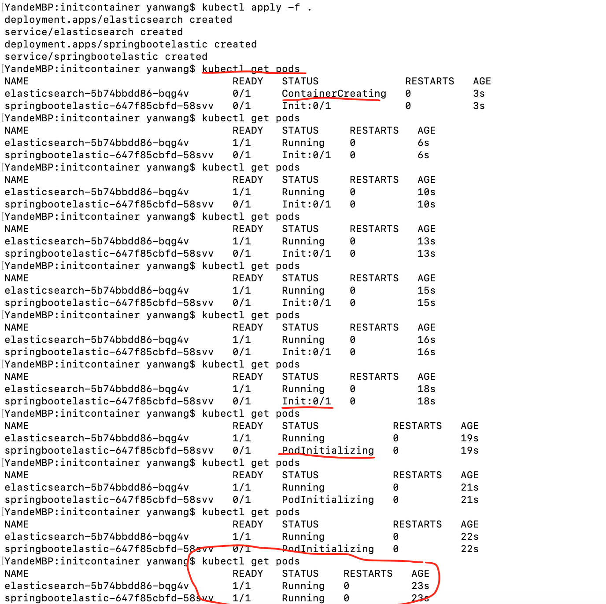

### Deploy SpringBootApplication and ElasticSearch on Kubernetes

This demo will show you how to deploy  SpringBootApplication and ElasticSearch on Kubernetes.

the demo will use the SpringBootApplication from [this link](https://github.com/wangyan100/springbootexamples/tree/master/spring-boot-elasticsearch)

#### Build docker image

-  gradle clean build

-  docker build  -t wangyan100/springbootelastic . 

#### Push docker image (wangyan100/springbootelastic) to docker hub

- create wangyan100/springbootelastic as repository at docker hub website, of course, you need register an account at docker hub website if you don't have one
- docker login

- enter docker hub's username and password 

- docker tag <image_id> wangyan100/springbootelastic:latest 

- docker push wangyan100/springbootelastic:latest

#### Write deployment and service yaml files 

- for SpringBootApplication, you could find example as below 
  
  
- for elasticsearch, you could find example as below shown
  

#### Install Kubernetes on your local machine

- follow [the link](https://kubernetes.io/docs/tasks/tools/install-minikube/) to install kubernetes on your local pc

#### Deploy Application on Kubernetes

- minikube start --memory 4096 (elasticsearch requires 4GB memory)

- deploy elasticsearch 

    ```
    cd spring-boot-elasticsearch/src/elastick8s
    kubectl apply -f . 
    ```
- wait elasticsearch is up and running 
   ```
   kubectl get pods
   NAME                                 READY   STATUS    RESTARTS   
   elasticsearch-5b74bbdd86-wgw2n       1/1     Running   0        
   ```
- deploy SpringBootApplication

    ```
    cd spring-boot-elasticsearch/src/springbootk8s
    kubectl apply -f . 
    ```
- get exposed URL of springboot and elasticsearch 

    ```
    minikube service springbootelastic --url
    http://192.168.99.113:31742
    
    minikube service elasticsearch --url
    http://192.168.99.113:30765
    http://192.168.99.113:32663
    ```
    
- use postman to send request to SpringBootApplication, it will create an entry at elasticsearch
  

- check result, it works 
  
  
- last but not least, you could use init container to define dependency since SpringBootApplication should be deployed after elasticsearch
  
  
- deploy by using initcontainer, as you can see, SpringBootApplication is deployed after elasticsearch is running
    ```
    cd spring-boot-elasticsearch/src/initcontainer
    kubectl apply -f . 
    ```
    
   


 