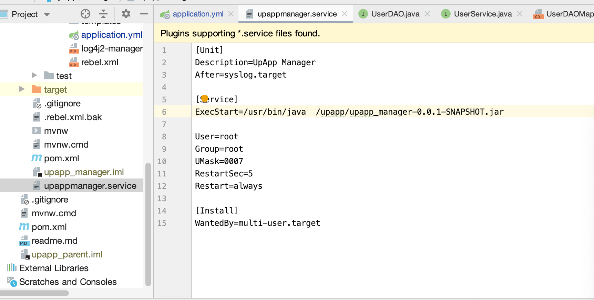

# Deploy SpringBoot as Service with Nginx Reverse Proxy Setting

In this example, we show you how to deploy SpringBoot as Service with Nginx Reverse Proxy setting.

By this approach, you could just run SpringBoot as a stand-alone application, and forward http request to it via Nginx. 

We assume you are using Ubutun, with JDK and Nginx installed already.


### Install SpringBoot as Service

- write a service script for the SpringBoot Application

  

- use below commands to manage the service that you just create

  ```sudo systemctl start upappmanager
  sudo systemctl start upappmanager
  
  sudo systemctl status upappmanager
  
  sudo systemctl stop upappmanager
  
  sudo systemctl restart upappmanager
  
  ```

### Config Reverse Proxy

- Nginx config to map forward the request upstream to the SpringBoot Application

```
##/etc/nginx/conf.d/upappmanager.conf
 
server {
        listen 80;
        listen [::]:80;
				#here you could also use subdomain
        server_name example.com;
        #here you could also use context,e.g. location /<context>
        location / {
             proxy_pass http://localhost:8080/;
             proxy_set_header X-Forwarded-For $proxy_add_x_forwarded_for;
             proxy_set_header X-Forwarded-Proto $scheme;
             proxy_set_header X-Forwarded-Port $server_port;
        }
}

server {
        listen 443;
        server_name example.com;
        ssl on;
        ssl_certificate /usr/local/nginx/ssl/example.com.crt;        
        ssl_certificate_key /usr/local/nginx/ssl/example.com.pem;
        ssl_session_cache shared:SSL:1m;
        ssl_session_timeout 5m;
        ssl_ciphers  HIGH:!aNULL:!MD5;
        ssl_prefer_server_ciphers  on;
        location / {
             proxy_pass http://127.0.0.1:8443;
             proxy_redirect off;
             proxy_set_header Host $host;
             proxy_set_header X-Real-IP $remote_addr;
             proxy_set_header X-Forwarded-For $proxy_add_x_forwarded_for;
        } 
}

```

- use below commands to test and restart nginx to make changes take effect

  ```
  # check nginx configuration 
  sudo nginx -t 
  
  # if there is no error, restart nginx to make changes take effect
  sudo systemctl restart nginx
  
  ```

  

  ### As you can see, it is working! 

  