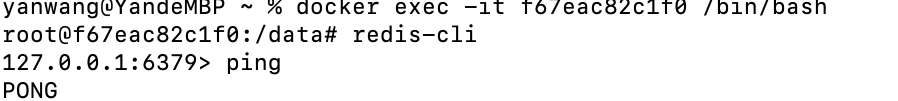
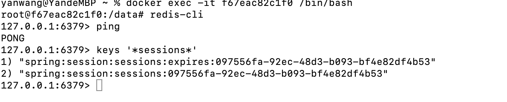
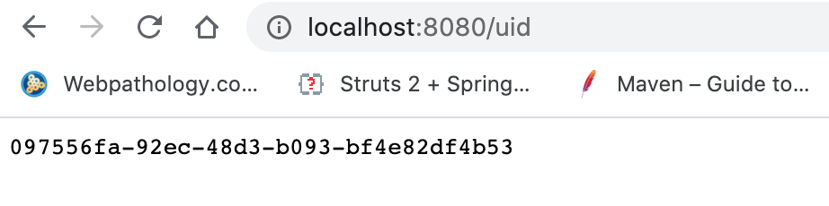

## SpringBoot with Redis Demo

By this demo, I will show you how to integrate SpringBoot with Redis, how to use redis for caching and session data sharing in SprinBoot.


#### Set up Redis 
- run redis locally via docker 
```
docker run -d  --name redisHostPort -p 6379:6379 redis:latest
```

- access redis docker container

```
docker exec -it f67eac82c1f0 /bin/bash
```

- check redis 
```
redis-cli 
ping
```

- if you see as below screenshot, your redis is ready to use ...

 

#### Set up SpringBoot with Redis 
- add dependency, spring-boot-starter-data-redis depends on spring-data-redis and lettuce which is redis client.
it is a scalable, its' Redis Connection could be shared by many threads.

```
  <dependency>
	 <groupId>org.springframework.boot</groupId>
	 <artifactId>spring-boot-starter-data-redis</artifactId>
  </dependency>
  <dependency>
	 <groupId>org.apache.commons</groupId>
	 <artifactId>commons-pool2</artifactId>
  </dependency>
  <dependency>
	 <groupId>org.springframework.boot</groupId>
	 <artifactId>spring-boot-starter-web</artifactId>
  </dependency>
  <dependency>
	 <groupId>org.springframework.session</groupId>
	 <artifactId>spring-session-data-redis</artifactId>
  </dependency>
```

- add SpringBoot Redis config
```
# REDIS
# redis database index
spring.redis.database=0  
# redis server address
spring.redis.host=localhost
# redis server port
spring.redis.port=6379  
# redis server password, default is empty
spring.redis.password=
# connection pool max size, default 8
spring.redis.lettuce.pool.max-active=8
# connection pool wait time, -1 means unlimited
spring.redis.lettuce.pool.max-wait=-1
# connection pool idle max connection size, default 8
spring.redis.lettuce.pool.max-idle=8
# connection pool idle min connection size, default is 0
spring.redis.lettuce.pool.min-idle=0

```


- to manually store key and value into Redis Cache and fetch it 

```
@RunWith(SpringRunner.class)
@SpringBootTest
class SpringbootRedisDemoApplicationTests {
	@Autowired
	private StringRedisTemplate stringRedisTemplate;
	@Autowired
	private RedisTemplate redisTemplate;

	@Test
	public void testForStringValue() throws Exception {
		stringRedisTemplate.opsForValue().set("key111", "value111");
		Assert.assertEquals("value111", stringRedisTemplate.opsForValue().get("key111"));
	}

	@Test
	public void testForObjValue() throws Exception {
		User user=new User("user1@email.com", "nicknameaaa", "aapassword", "useraaa","2020-05-30");
		ValueOperations<String, User> operations=redisTemplate.opsForValue();
		//save user with key useraaa
		operations.set("useraaa", user);
		//save user with key useraaa_x with timeout
		operations.set("useraaa_x", user,1, TimeUnit.SECONDS);

		// sleep time is longer than timeout
		Thread.sleep(2000);

		//key without timeout still exists
		if(redisTemplate.hasKey("useraaa")){
			System.out.println("key useraaa exists");
		}
    // key with timeout does not exist anymore
		if(redisTemplate.hasKey("useraaa_x")){
			System.out.println("key useraaa_x exists");
		}
		//fetch user based on key
		Assert.assertEquals("useraaa", operations.get("useraaa").getUserName());
	}
}

```

- at Spring Controller, automatically store object to Redis cache and fetch it 

  - add RedisConfig 
  ```
  @Configuration
  @EnableCaching
  public class RedisConfig extends CachingConfigurerSupport{
  
      //define your own KeyGenerator to avoid the problem caused by different package with same params may have same key
      @Bean
      public KeyGenerator keyGenerator() {
          return new KeyGenerator() {
              @Override
              public Object generate(Object target, Method method, Object... params) {
                  StringBuilder sb = new StringBuilder();
                  sb.append(target.getClass().getName());
                  sb.append(method.getName());
                  for (Object obj : params) {
                      sb.append(obj.toString());
                  }
                  System.out.println("keyGenerator is invoked, key ->  "+sb.toString());
                  return sb.toString();
              }
          };
      }
  }
  ```
  
  - use @Cacheable at controller method to store Object into Redis Cache
  ```
      @RequestMapping("/getUser")
      @Cacheable(value="user-key")
      public User getUser() {
          User user=new User("useremail@email.org", "nickname", "password", "name","2020-05-30");
          System.out.println("If this line is not printed out, it means user is fetched from cache");
          return user;
      }
  ```
  
####  Session sharing
On distributed System, there are many ways for Session sharing, here we use redis to manage and share the session
Spring session offers clustered session which could use Redis to store session data as Session sharing solution.

- add dependency 
```
<dependency>
    <groupId>org.springframework.session</groupId>
    <artifactId>spring-session-data-redis</artifactId>
</dependency
```

- Session configuration
      
  ```
    @Configuration
    @EnableRedisHttpSession(maxInactiveIntervalInSeconds = 86400*30)
        public class SessionConfig {
    }
  ```
  
  > maxInactiveIntervalInSeconds: to set expired period for session. After using Redis,
   server.session.timeout will not take effects anymore. 
  
- Test 
  add Test method to get sessionid 
  
  ```
  @RequestMapping("/uid")
  String uid(HttpSession session) {
      UUID uid = (UUID) session.getAttribute("uid");
      if (uid == null) {
          uid = UUID.randomUUID();
      }
      session.setAttribute("uid", uid);
      return session.getId();
  }
  ```
  
  access Redis, type keys '*sessions*'      
                                                                                                                                                              
        
  
  First line is session expired time, second line is sessionid, it is same as http://localhost:8080/uid      
  , which means Redis already manages the session effectively 
     
  
  #### How to share session between two or more Applications    
  You just need to repeat above session configuration in another application.
  
  
  ​                                                                                                                                                                                 

